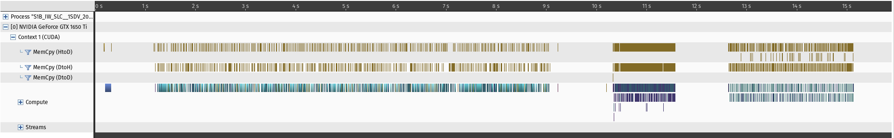

# Performance overview

Algorithmic wise the Sentinel1 algorithms are ported/influenced from [ESA SNAP](https://step.esa.int/main/toolboxes/snap/) toolbox.  
Overall ALUS should always be faster than the equivalent SNAP algorithm.

## Example performance test

Reference laptop computer details:  
CPU: i7 10750h, 16GB RAM
GPU: GTX 1650Ti Mobile  
SSD: M.2  

Reference datasets:  
S1B_IW_SLC__1SDV_20210124T164217_20210124T164244_025299_03034D_690D  
S1B_IW_SLC__1SDV_20210112T164218_20210112T164245_025124_02FDBF_2399  

Full swath(1.4GB SLC data) landmass only processing time:  
Coherence estimation routine: 15.7s 
Calibration routine: 5.8s  

Coherence estimation routine means: 2 x input SLC coregistration(split + apply orbit file + backgeocoding) -> coherence estimation -> deburst -> range doppler terrain correction -> GTiff output  
Calibration routine means: 1 x input SLC S1 calibration -> deburst -> range doppler terrain correction -> GTiff output  

With this setup, improving the GPU would lower the overall algorithm execution time.  
However there is no point using a high-end GPU with low-end disk, as then the bottleneck would be disk I/O.

Profiling graphs exported from [NVVP](https://developer.nvidia.com/nvidia-visual-profiler) :  
  


## Factors heavily influencing performance

### GPU selection

Requires 2GB of GPU memory and Compute capability of >=5.0

The most important criteria for choosing a GPU is FP64(double) FLOPS. Unfortunately most of the consumer GPUs have theoretical performance peak ratio of FP32 : FP64 as 1:32(newer GTX30X0 has 1:64). This becomes a bottleneck in multiple calculations and is likely the limiting factor on regular consumer GPUs. Theoretically, a heavily optimized fast CPU based implementation of the same algorithms should match or beat ALUS performance on double heavy algorithms with lower end consumer GPUs.

The information for GPU FP32:FP64 performance ratio for a partiuclar device can be looked at [NVidia documentation](https://docs.nvidia.com/cuda/cuda-c-programming-guide/index.html#arithmetic-instructions)

The software currently does not properly utilize high end GPUs with lots of memory. Due to support for low-end GPUs, ALUS does not store images on GPU, rather it just transfers the image to GPU and back via tiles and only does raster calculations on the GPU. This strategy is a must on low-end GPUs, but on faster datacenter GPUs with lots of memory, this is a performance issue, as more time is spent transferring data and building intermediate results on the CPU. Expect significant performance improvements in upcoming versions for large GPUs. 

### Storage

A high performance SSD is a requirement, otherwise there is no point to hassle with GPU processing. For example virtual SSDs on VMs, as storage transfer is just not fast enough for processing this kind of data.

Also, it is recommended clearing the page cache when performing benchmarking:  
```sudo sh -c 'echo 3 > /proc/sys/vm/drop_caches'```


