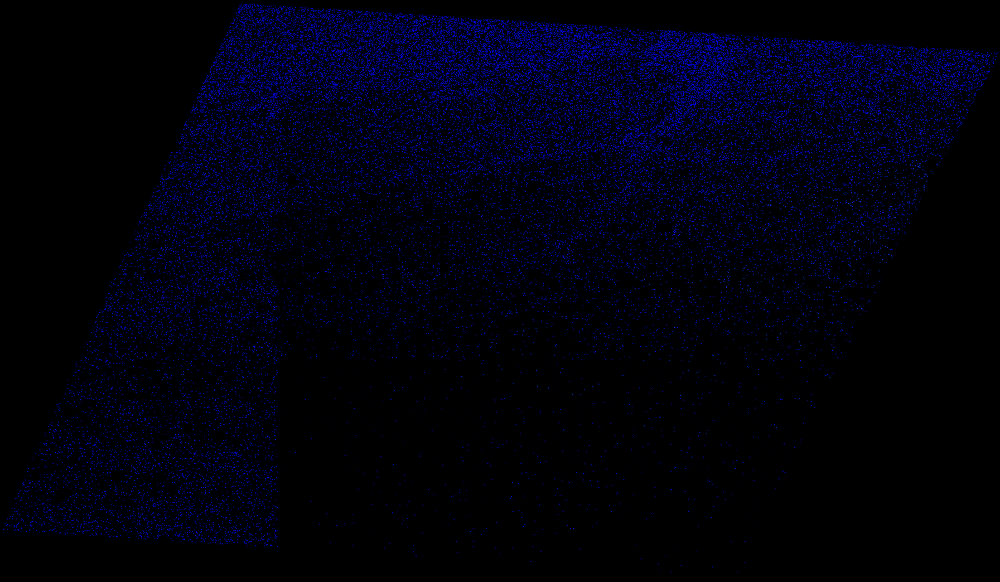

# Calibration routine

Calibration routine consists of:

* Sentinel-1 SLC split
* Thermal noise removal
* Calibration
* Deburst
* Range doppler terrain correction

## Arguments

### alus-cal

```
  -h [ --help ]              Print help
  -i [ --input ] arg         Input SAFE dataset (zipped or unpacked)
  -o [ --output ] arg        Output folder or filename
  -w [ --wif ]               Write intermediate results (will be saved in the 
                             same folder as final outcome). NOTE - this may 
                             decrease performance. Default OFF.
  --sw arg                   Subswath for which the calibration will be 
                             performed, one of the following - IW1;IW2;IW3
  -p [ --polarisation ] arg  Polarisation for which the calibration will be 
                             performed - VV;VH
  --bi1 arg                  First burst index - starting at '1', leave 
                             unspecified for whole subswath
  --bi2 arg                  Last burst index - starting at '1', leave 
                             unspecified for whole subswath
  -a [ --aoi ] arg           Area Of Interest WKT polygon, overrules first and 
                             last burst indexes
  -t [ --type ] arg          Type of calibration to be performed, one of the 
                             following - sigma;beta;gamma;dn
  --dem arg                  DEM file(s). SRTM3 and Copernicus DEM 30m COG are
                             currently supported.
  --ll arg (=verbose)        Log level, one of the following - 
                             verbose|debug|info|warning|error
  --gpu_mem arg (=100)       Percentage of how much GPU memory can be used for 
                             processing
```

## Performance

Reference laptop computer details:  
CPU: Intel i7 10750h </br>
RAM: 32GB </br>
GPU: NVIDIA GeForce GTX 1660 Ti 6GB </br>
SSD (NVMe): SAMSUNG MZALQ512HALU-000L2

Compared against SNAP 8 GPT on Ubuntu 20.04. </br>
Configuration: </br>
-Xmx22381m </br>
-Xms2048m </br>
-XX:+AggressiveOpts </br>
-Xverify:none </br>
-Dnetbeans.mainclass=org.esa.snap.main.Main </br>
-Dsun.java2d.noddraw=true </br>
-Dsun.awt.nopixfmt=true </br>
-Dsun.java2d.dpiaware=false </br>
Tile size 512 </br>
Number of threads 12

Input:

* S1A_IW_SLC__1SDV_20210703T055050_20210703T055117_038609_048E45_35F7.SAFE

Processing options:

* Subswath IW2 (all bursts)
* Polarisation VV
* calibration type sigma

For more raw computing comparison, the IW2 subswath GeoTIFF file has been stored on ram disk - this way I/O influences
results less. Also outputs are stored on ram disk.

```
./gpt calibration_routine_snap_graph.xml 
-Pinput=S1A_IW_SLC__1SDV_20210703T055050_20210703T055117_038609_048E45_35F7.SAFE/manifest.safe
-Poutput=/mnt/ramdisk/snap_cal_iw2.tif -Psw=IW2 -Ppol=VV
```

~42.5 seconds

```
./alus-cal -i S1A_IW_SLC__1SDV_20210703T055050_20210703T055117_038609_048E45_35F7.SAFE -o /mnt/ramdisk --sw IW2 -p VV 
-t sigma --dem srtm_37_02.tif --dem srtm_37_03.tif --dem srtm_38_02.tif --dem srtm_38_03.tif --ll info
```

~7.4 seconds

```
gdal_calc.py -A S1A_IW_SLC__1SDV_20210703T055050_20210703T055117_038609_048E45_35F7_split_tnr_Cal_deb_TC_snap.tif 
-B S1A_IW_SLC__1SDV_20210703T055050_20210703T055117_038609_048E45_35F7_tnr_Cal_IW2_deb_tc.tif --calc="A-B" 
--outfile=/tmp/snap_man_min_alus_cal_diff.tif --NoDataValue=0
```

Resulting diff file statistics:
```
Band 1 Block=14224x1 Type=Float32, ColorInterp=Gray
    Computed Min/Max=-0.004,0.004
  Minimum=-0.004, Maximum=0.004, Mean=0.000, StdDev=0.000
  NoData Value=0
  Metadata:
    STATISTICS_MAXIMUM=0.00408935546875
    STATISTICS_MEAN=1.6726067428608e-09
    STATISTICS_MINIMUM=-0.0042724609375
    STATISTICS_STDDEV=4.1099733990715e-06
    STATISTICS_VALID_PERCENT=4.028
```

Legend</br>


Full scene</br>

