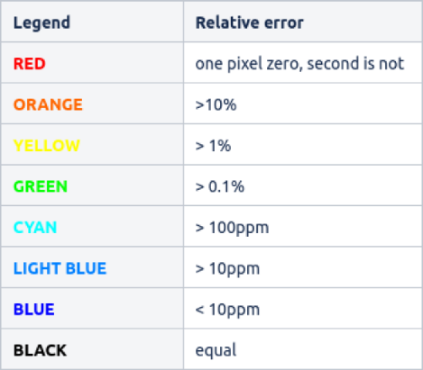

# Calibration routine

Calibration routine consists of:

* Sentinel-1 SLC split
* Thermal noise removal
* Calibration
* Deburst
* Range doppler terrain correction

## Arguments

### alus-cal

```
ALUs - Calibration
Version 1.4.0

Arguments:

  -h [ --help ]              Print help
  -i [ --input ] arg         Input SAFE dataset (zipped or unpacked)
  -o [ --output ] arg        Output folder or filename
  -w [ --wif ]               Write intermediate results (will be saved in the 
                             same folder as final outcome). NOTE - this may 
                             decrease performance. Default OFF.
  --sw arg                   Subswath for which the calibration will be 
                             performed, one of the following - IW1;IW2;IW3
  -p [ --polarisation ] arg  Polarisation for which the calibration will be 
                             performed - VV;VH
  --bi1 arg                  First burst index - starting at '1', leave 
                             unspecified for whole subswath
  --bi2 arg                  Last burst index - starting at '1', leave 
                             unspecified for whole subswath
  -a [ --aoi ] arg           Area Of Interest WKT polygon. Or shapefile (.shp) 
                             consisting similar geometry.Overrules first and 
                             last burst indexes and subswath selections.
  -t [ --type ] arg          Type of calibration to be performed, one of the 
                             following - sigma;beta;gamma;dn
  --dem arg                  DEM file(s). SRTM3 and Copernicus DEM 30m COG are 
                             currently supported.

  --ll arg (=verbose)        Log level, one of the following - 
                             verbose|debug|info|warning|error
  --gpu_mem arg (=100)       Percentage of how much GPU memory can be used for 
                             processing


https://github.com/cgi-estonia-space/ALUs
```

## Performance

Reference laptop computer details:  
CPU: Intel i7 10750h </br>
RAM: 32GB </br>
GPU: NVIDIA GeForce GTX 1660 Ti 6GB </br>
SSD (NVMe): SAMSUNG MZALQ512HALU-000L2

Compared against SNAP 8 GPT on Ubuntu 20.04. </br>
Configuration: </br>
-Xmx22381m </br>
-Xms2048m </br>
-XX:+AggressiveOpts </br>
-Xverify:none </br>
-Dnetbeans.mainclass=org.esa.snap.main.Main </br>
-Dsun.java2d.noddraw=true </br>
-Dsun.awt.nopixfmt=true </br>
-Dsun.java2d.dpiaware=false </br>
Tile size 512 </br>
Number of threads 12

Input:

* S1A_IW_SLC__1SDV_20210703T055050_20210703T055117_038609_048E45_35F7.SAFE

Processing options:

* Subswath IW2 (all bursts)
* Polarisation VV
* calibration type sigma

For more raw computing comparison, the IW2 subswath GeoTIFF file has been stored on ram disk - this way I/O influences
results less. Also outputs are stored on ram disk.

SNAP using SRTM3
```
./gpt calibration_routine_snap_graph.xml 
-Pinput=S1A_IW_SLC__1SDV_20210703T055050_20210703T055117_038609_048E45_35F7.SAFE/manifest.safe
-Poutput=/mnt/ramdisk/snap_cal_iw2.tif -Psw=IW2 -Ppol=VV
```

~42.5 seconds

SRTM3
```
./alus-cal -i S1A_IW_SLC__1SDV_20210703T055050_20210703T055117_038609_048E45_35F7.SAFE -o /mnt/ramdisk --sw IW2 -p VV 
-t sigma --dem srtm_37_02.tif --dem srtm_37_03.tif --dem srtm_38_02.tif --dem srtm_38_03.tif --ll info
```

Output:
```
[2023-02-22 16:10:55.524778] [0x00007fd0ad7df000] [info]    Processing parameters:
Input product - ../S1A_IW_SLC__1SDV_20210703T055050_20210703T055117_038609_048E45_35F7.SAFE
Subswath - IW2
Polarisation - VV
Calibration type - sigma
First burst index - 0
Last burst index - 0
AOI - 
Write intermediate files - NO

[2023-02-22 16:10:55.699153] [0x00007fd0ad7df000] [info]    Sentinel 1 split done - 174ms
[2023-02-22 16:10:55.699182] [0x00007fd0ad7df000] [info]    Using 'NVIDIA GeForce GTX 1660 Ti' device nr 0 for calculations
[2023-02-22 16:10:55.709495] [0x00007fd0ad7df000] [info]    Target bands count: 1
[2023-02-22 16:10:55.709515] [0x00007fd0ad7df000] [info]    Processing band i_IW2_VV_VV
[2023-02-22 16:10:58.266871] [0x00007fd0ad7df000] [info]    Thermal noise removal done - 2567ms
[2023-02-22 16:10:58.289810] [0x00007fd0ad7df000] [info]    target bands count 1
[2023-02-22 16:10:58.289835] [0x00007fd0ad7df000] [info]    Processing band Sigma0_IW2_VV_VV
[2023-02-22 16:10:59.024776] [0x00007fd0ad7df000] [info]    Sentinel1 calibration done - 757ms
[2023-02-22 16:10:59.137422] [0x00007fd0ad7b5000] [info]    Loading SRTM3 tile ID 3702 to GPU
[2023-02-22 16:10:59.219146] [0x00007fd0ad7b5000] [info]    Loading SRTM3 tile ID 3703 to GPU
[2023-02-22 16:10:59.286741] [0x00007fd0ad7b5000] [info]    Loading SRTM3 tile ID 3802 to GPU
[2023-02-22 16:10:59.365022] [0x00007fd0ad7b5000] [info]    Loading SRTM3 tile ID 3803 to GPU
[2023-02-22 16:11:00.287164] [0x00007fd0ad7df000] [info]    TOPSAR Deburst done - 1186ms
[2023-02-22 16:11:00.287185] [0x00007fd0ad7df000] [info]    Merge done - 0ms
[2023-02-22 16:11:02.285407] [0x00007fd0ad7df000] [info]    Terrain correction done - 1998ms
[2023-02-22 16:11:02.539286] [0x00007fd0ad7df000] [info]    Algorithm completed, output file @ S1A_IW_SLC__1SDV_20210703T055050_20210703T055117_038609_048E45_35F7_split_IW2_tnr_cal_deb_tc_srtm3.tif
[2023-02-22 16:11:02.539304] [0x00007fd0ad7df000] [info]    Another test
[2023-02-22 16:11:02.701453] [0x00007fd0ad7df000] [info]    Unloading SRTM3 tiles from GPU
~/alus/alus-github/cmake-build-release/alus_package/alus-cal -i  -t sigma -p   10.14s user 4.80s system 204% cpu 7.319 total
```

~7.4 seconds

COPDEM 30m

```
time ~/alus/alus-github/cmake-build-release/alus_package/alus-cal -i ../S1A_IW_SLC__1SDV_20210703T055050_20210703T055117_038609_048E45_35F7.SAFE -t sigma -p VV --sw IW2 --dem Copernicus_DSM_COG_10_N49_00_E004_00_DEM.tif --dem Copernicus_DSM_COG_10_N49_00_E005_00_DEM.tif --dem Copernicus_DSM_COG_10_N50_00_E004_00_DEM.tif --dem Copernicus_DSM_COG_10_N50_00_E005_00_DEM.tif --dem Copernicus_DSM_COG_10_N50_00_E006_00_DEM.tif --dem Copernicus_DSM_COG_10_N51_00_E004_00_DEM.tif --dem Copernicus_DSM_COG_10_N51_00_E005_00_DEM.tif -o S1A_IW_SLC__1SDV_20210703T055050_20210703T055117_038609_048E45_35F7_split_IW2_tnr_cal_deb_tc_copdem.tif --ll info
```

Output:
```
[2023-02-22 16:14:45.802223] [0x00007f56b8beb000] [info]    Processing parameters:
Input product - ../S1A_IW_SLC__1SDV_20210703T055050_20210703T055117_038609_048E45_35F7.SAFE
Subswath - IW2
Polarisation - VV
Calibration type - sigma
First burst index - 0
Last burst index - 0
AOI - 
Write intermediate files - NO

[2023-02-22 16:14:45.970436] [0x00007f56b8beb000] [info]    Sentinel 1 split done - 168ms
[2023-02-22 16:14:45.970468] [0x00007f56b8beb000] [info]    Using 'NVIDIA GeForce GTX 1660 Ti' device nr 0 for calculations
[2023-02-22 16:14:45.980603] [0x00007f56b8beb000] [info]    Target bands count: 1
[2023-02-22 16:14:45.980623] [0x00007f56b8beb000] [info]    Processing band i_IW2_VV_VV
[2023-02-22 16:14:48.551814] [0x00007f56b8beb000] [info]    Thermal noise removal done - 2581ms
[2023-02-22 16:14:48.577451] [0x00007f56b8beb000] [info]    target bands count 1
[2023-02-22 16:14:48.577472] [0x00007f56b8beb000] [info]    Processing band Sigma0_IW2_VV_VV
[2023-02-22 16:14:49.305179] [0x00007f56b8beb000] [info]    Sentinel1 calibration done - 753ms
[2023-02-22 16:14:49.423885] [0x00007f56b8beb000] [info]    COPDEM COG 30m tile ID 184041 loaded to GPU
[2023-02-22 16:14:49.451727] [0x00007f56b8beb000] [info]    COPDEM COG 30m tile ID 185041 loaded to GPU
[2023-02-22 16:14:49.469917] [0x00007f56b8beb000] [info]    COPDEM COG 30m tile ID 184040 loaded to GPU
[2023-02-22 16:14:49.489668] [0x00007f56b8beb000] [info]    COPDEM COG 30m tile ID 185040 loaded to GPU
[2023-02-22 16:14:49.507455] [0x00007f56b8beb000] [info]    COPDEM COG 30m tile ID 186040 loaded to GPU
[2023-02-22 16:14:49.526330] [0x00007f56b8beb000] [info]    COPDEM COG 30m tile ID 184039 loaded to GPU
[2023-02-22 16:14:49.547010] [0x00007f56b8beb000] [info]    COPDEM COG 30m tile ID 185039 loaded to GPU
[2023-02-22 16:14:50.888571] [0x00007f56b8beb000] [info]    TOPSAR Deburst done - 1340ms
[2023-02-22 16:14:50.888591] [0x00007f56b8beb000] [info]    Merge done - 0ms
[2023-02-22 16:14:52.809788] [0x00007f56b8beb000] [info]    Terrain correction done - 1921ms
[2023-02-22 16:14:53.065011] [0x00007f56b8beb000] [info]    Algorithm completed, output file @ S1A_IW_SLC__1SDV_20210703T055050_20210703T055117_038609_048E45_35F7_split_IW2_tnr_cal_deb_tc_copdem.tif
[2023-02-22 16:14:53.065030] [0x00007f56b8beb000] [info]    Another test
[2023-02-22 16:14:53.191100] [0x00007f56b8beb000] [info]    Unloading COPDEM COG 30m tiles
~/alus/alus-github/cmake-build-release/alus_package/alus-cal -i  -t sigma -p   12.02s user 4.90s system 224% cpu 7.544 total
```

~7.5-8 seconds

## Comparison

```
gdal_calc.py -A S1A_IW_SLC__1SDV_20210703T055050_20210703T055117_038609_048E45_35F7_split_tnr_Cal_deb_TC_snap.tif 
-B S1A_IW_SLC__1SDV_20210703T055050_20210703T055117_038609_048E45_35F7_tnr_Cal_IW2_deb_tc.tif --calc="A-B" 
--outfile=/tmp/snap_man_min_alus_cal_diff.tif --NoDataValue=0
```

Resulting diff file statistics when using SRTM3:
```
Band 1 Block=14224x1 Type=Float32, ColorInterp=Gray
    Computed Min/Max=-0.004,0.004
  Minimum=-0.004, Maximum=0.004, Mean=0.000, StdDev=0.000
  NoData Value=0
  Metadata:
    STATISTICS_MAXIMUM=0.00408935546875
    STATISTICS_MEAN=1.6726067428608e-09
    STATISTICS_MINIMUM=-0.0042724609375
    STATISTICS_STDDEV=4.1099733990715e-06
    STATISTICS_VALID_PERCENT=4.028
```

Legend</br>


Difference when using SRTM3 DEM</br>


Difference when using Copernicus DEM 30m COG</br>

There are known bugs for both of the tools when using Copernicus DEM documented in - https://forum.step.esa.int/t/copernicus-dem-complications-when-coregistering-s1/38659/2

```
gdal_calc.py -A snap/S1A_IW_SLC__1SDV_20210703T055050_20210703T055117_038609_048E45_35F7_split_IW2_tnr_Cal_deb_TC_copdem_no_data.tif -B S1A_IW_SLC__1SDV_20210703T055050_20210703T055117_038609_048E45_35F7_split_IW2_tnr_cal_deb_tc_copdem.tif --calc="A-B" --outfile=S1A_IW_SLC__1SDV_20210703T055050_20210703T055117_038609_048E45_35F7_split_IW2_tnr_cal_deb_tc_copdem_snap_min_alus_diff.tif --NoDataValue=0
```

Resulting diff file statistics:

```
Band 1 Block=14224x1 Type=Float32, ColorInterp=Gray
  Minimum=-0.000, Maximum=0.000, Mean=0.000, StdDev=0.000
  NoData Value=0
  Metadata:
    STATISTICS_MAXIMUM=4.5299530029297e-05
    STATISTICS_MEAN=4.0933211844668e-10
    STATISTICS_MINIMUM=-2.6583671569824e-05
    STATISTICS_STDDEV=1.6678710960146e-07
    STATISTICS_VALID_PERCENT=0.2109
```

The match is nearly identical for Copernicus DEM, since its resolution is higher and less floating point arithmetics
introduced rounding errors between interpolated values of the pixels. The relative difference picture is almost
completely dark, hence not shown here, since there are very few pixels with very little difference that are not visually
detectable.

## Sources and resulting files

Inputs
* [S1A_IW_SLC__1SDV_20210703T055050_20210703T055117_038609_048E45_35F7.SAFE](https://alus-goods-set.s3.eu-central-1.amazonaws.com/validation/flood_in_belgium_germany/S1A_IW_SLC__1SDV_20210703T055050_20210703T055117_038609_048E45_35F7.zip)
* [Auxilliary files](https://alus-goods-set.s3.eu-central-1.amazonaws.com/validation/flood_in_belgium_germany/aux.zip)

Processed using Copernicus DEM
* [ALUs result](https://alus-goods-set.s3.eu-central-1.amazonaws.com/alus_repo_docs/calibration_routine_readme/S1A_IW_SLC__1SDV_20210703T055050_20210703T055117_038609_048E45_35F7_split_IW2_tnr_cal_deb_tc_copdem.tif)
* [SNAP result](https://alus-goods-set.s3.eu-central-1.amazonaws.com/alus_repo_docs/calibration_routine_readme/S1A_IW_SLC__1SDV_20210703T055050_20210703T055117_038609_048E45_35F7_split_IW2_tnr_Cal_deb_TC_copdem_no_data.tif)
* [SNAP BEAM DIMAP project](https://alus-goods-set.s3.eu-central-1.amazonaws.com/alus_repo_docs/calibration_routine_readme/S1A_IW_SLC__1SDV_20210703T055050_20210703T055117_038609_048E45_35F7_split_IW2_tnr_Cal_deb_TC_copdem.dim.zip)
* [Relative diff](https://alus-goods-set.s3.eu-central-1.amazonaws.com/alus_repo_docs/calibration_routine_readme/S1A_IW_SLC__1SDV_20210703T055050_20210703T055117_038609_048E45_35F7_split_IW2_tnr_cal_deb_tc_copdem_rel_diff.tif)
* [Colored diff](https://alus-goods-set.s3.eu-central-1.amazonaws.com/alus_repo_docs/calibration_routine_readme/S1A_IW_SLC__1SDV_20210703T055050_20210703T055117_038609_048E45_35F7_split_IW2_tnr_cal_deb_tc_copdem_clr_diff.tif)
* [gdal_calc diff](https://alus-goods-set.s3.eu-central-1.amazonaws.com/alus_repo_docs/calibration_routine_readme/S1A_IW_SLC__1SDV_20210703T055050_20210703T055117_038609_048E45_35F7_split_IW2_tnr_cal_deb_tc_copdem_snap_min_alus_diff.tif)
