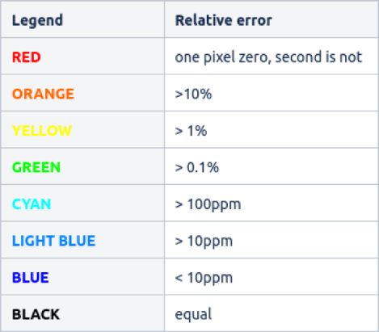
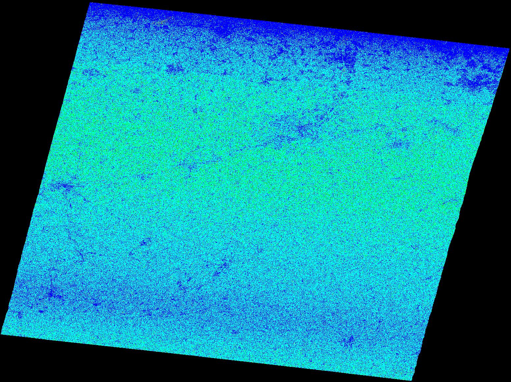
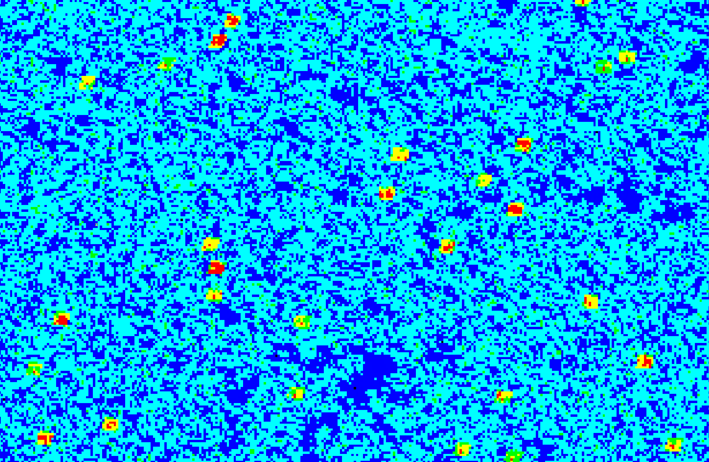

# Coherence Estimation routine

Coherence estimation routine consists of:  

* 2 x input SLC coregistration(split + apply orbit file + backgeocoding)
* Coherence estimation
* Deburst
* Merge (when multiple subswaths selected)
* Range doppler terrain correction  

## Arguments

### alus-coh

```
  -h [ --help ]                         Print help
  -r [ --in_ref ] arg                   Reference scene's input SAFE dataset 
                                        (zipped or unpacked)
  -s [ --in_sec ] arg                   Secondary scene's input SAFE dataset 
                                        (zipped or unpacked)
  --b_ref1 arg                          Reference scene's first burst index - 
                                        starting at '1', leave unspecified for 
                                        whole subswath
  --b_ref2 arg                          Reference scene's last burst index - 
                                        starting at '1', leave unspecified for 
                                        whole subswath
  --b_sec1 arg                          Secondary scene's first burst index - 
                                        starting at '1', leave unspecified for 
                                        whole subswath
  --b_sec2 arg                          Secondary scene's last burst index - 
                                        starting at '1', leave unspecified for 
                                        whole subswath
  --orbit_ref arg                       Reference scene's POEORB/RESORB file. 
                                        Can be unspecified.
  --orbit_sec arg                       Secondary scene's POEORB/RESORB file. 
                                        Can be unspecified.
  -o [ --output ] arg                   Output folder or filename
  -p [ --polarisation ] arg             Polarisation for which coherence 
                                        estimation will be performed - VV;VH
  --sw arg                              Reference scene's subswath
  -a [ --aoi ] arg                      Area Of Interest WKT polygon, overrules
                                        first and last burst indexes
  --dem arg                             DEM file(s). SRTM3 and Copernicus DEM
                                        30m COG are currently supported.
  --no_mask_cor                         Do not mask out areas without elevation
                                        in coregistration
  --orbit_dir arg                       Directory of orbit files (restituted 
                                        and/or precise). Can be used to find 
                                        correct one during processing. Can be 
                                        unspecified - hence no orbital 
                                        information is updated. Also supports 
                                        ESA SNAP compatible folder for example:
                                        /home/<user>/.snap/auxData/Orbits/Senti
                                        nel-1/POEORB/
  --srp_number_points arg (=501)
  --srp_polynomial_degree arg (=5)
  --subtract_flat_earth_phase arg (=1)  Compute flat earth phase subtraction 
                                        during coherence operation. By default 
                                        on.
  --rg_win arg (=15)                    range window size in pixels.
  --az_win arg (=0)                     azimuth window size in pixels, if zero 
                                        derived from range window.
  --orbit_degree arg (=3)
  -w [ --wif ]                          Write intermediate results (will be 
                                        saved in the same folder as final 
                                        outcome). NOTE - this may decrease 
                                        performance. By default off.

  --ll arg (=verbose)                   Log level, one of the following - 
                                        verbose|debug|info|warning|error
  --gpu_mem arg (=100)                  Percentage of how much GPU memory can 
                                        be used for processing


```

### alus-coht

```
  -h [ --help ]                         Print help
  -i [ --input ] arg                    Timeline search directory
  -s [ --timeline_start ] arg           Timeline start - format YYYYMMDD
  -e [ --timeline_end ] arg             Timeline end - format YYYYMMDD
  -m [ --timeline_mission ] arg         Timeline mission filter - S1A or S1B
  -o [ --output ] arg                   Output folder or filename
  -p [ --polarisation ] arg             Polarisation for which coherence 
                                        estimation will be performed - VV;VH
  --sw arg                              Reference scene's subswath
  -a [ --aoi ] arg                      Area Of Interest WKT polygon, overrules
                                        first and last burst indexes
  --dem arg                             DEM file(s). Only SRTM3 is currently 
                                        supported.
  --no_mask_cor                         Do not mask out areas without elevation
                                        in coregistration
  --orbit_dir arg                       Directory of orbit files (restituted 
                                        and/or precise). Can be used to find 
                                        correct one during processing. Can be 
                                        unspecified - hence no orbital 
                                        information is updated. Also supports 
                                        ESA SNAP compatible folder for example:
                                        /home/<user>/.snap/auxData/Orbits/Senti
                                        nel-1/POEORB/
  --srp_number_points arg (=501)
  --srp_polynomial_degree arg (=5)
  --subtract_flat_earth_phase arg (=1)  Compute flat earth phase subtraction 
                                        during coherence operation. By default 
                                        on.
  --rg_win arg (=15)                    range window size in pixels.
  --az_win arg (=0)                     azimuth window size in pixels, if zero 
                                        derived from range window.
  --orbit_degree arg (=3)
  -w [ --wif ]                          Write intermediate results (will be 
                                        saved in the same folder as final 
                                        outcome). NOTE - this may decrease 
                                        performance. By default off.

  --ll arg (=verbose)                   Log level, one of the following - 
                                        verbose|debug|info|warning|error
  --gpu_mem arg (=100)                  Percentage of how much GPU memory can 
                                        be used for processing
```

## Performance

Reference laptop computer details:  
CPU: Intel i7 10750h </br>
RAM: 32GB </br>
GPU: NVIDIA GeForce GTX 1660 Ti 6GB </br>
SSD (NVMe): SAMSUNG MZALQ512HALU-000L2 

Compared against SNAP 8 GPT on Ubuntu 20.04. </br>
Configuration: </br>
-Xmx22381m </br>
-Xms2048m </br>
-XX:+AggressiveOpts </br>
-Xverify:none </br>
-Dnetbeans.mainclass=org.esa.snap.main.Main </br>
-Dsun.java2d.noddraw=true </br>
-Dsun.awt.nopixfmt=true </br>
-Dsun.java2d.dpiaware=false </br>
Tile size 512 </br>
Number of threads 12

Inputs:  

* S1A_IW_SLC__1SDV_20210703T055050_20210703T055117_038609_048E45_35F7.SAFE
* S1B_IW_SLC__1SDV_20210721T055001_20210721T055028_027888_0353E2_E1B5.SAFE

Processing options:  

* Subswath IW2 (all bursts)
* Polarisation VV

For more raw computing comparison, the IW2 subswath GeoTIFF file has been stored on ram disk - this way I/O influences
results less. Also outputs are stored on ram disk.

When using SRTM3 DEM
```
./gpt coherence_estimation_snap_graph.xml -Preference=S1A_IW_SLC__1SDV_20210703T055050_20210703T055117_038609_048E45_35F7.SAFE/manifest.safe 
-Psecondary=S1B_IW_SLC__1SDV_20210721T055001_20210721T055028_027888_0353E2_E1B5.SAFE/manifest.safe -Psw=IW2 -Ppol=VV 
-Poutput=/mnt/ramdisk/snap_iw2.tif
```

~85.666 seconds

```
./alus-coh -r S1A_IW_SLC__1SDV_20210703T055050_20210703T055117_038609_048E45_35F7.SAFE 
-s S1B_IW_SLC__1SDV_20210721T055001_20210721T055028_027888_0353E2_E1B5.SAFE --orbit_dir flood_in_belgium_germany/aux 
--sw IW2 -p VV -o /mnt/ramdisk --dem flood_in_belgium_germany/aux/srtm_37_02.tif
--dem flood_in_belgium_germany/aux/srtm_37_03.tif --dem flood_in_belgium_germany/aux/srtm_38_02.tif 
--dem flood_in_belgium_germany/aux/srtm_38_03.tif --ll info --no_mask_cor
```

~13.4 seconds

```
gdal_calc.py -A S1A_IW_SLC__1SDV_20210703T055050_20210703T055117_038609_048E45_35F7_Orb_Stack_coh_deb_TC_no_data.tif 
-B S1A_IW_SLC__1SDV_20210703T055050_20210703T055117_038609_048E45_35F7_Orb_Stack_coh_deb_tc.tif --calc="A-B" 
--outfile=snap_man_min_alus_diff.tif --NoDataValue=0
```

Resulting diff file statistics:
```
Band 1 Block=14224x1 Type=Float32, ColorInterp=Gray
  Min=-0.873 Max=0.311 
  Minimum=-0.873, Maximum=0.311, Mean=-0.000, StdDev=0.003
  NoData Value=3.40282346600000016e+38
  Metadata:
    STATISTICS_MAXIMUM=0.31110879778862
    STATISTICS_MEAN=-7.2791041110424e-05
    STATISTICS_MINIMUM=-0.87261736392975
    STATISTICS_STDDEV=0.0033343616817697
    STATISTICS_VALID_PERCENT=43.46
```

Legend</br>


Full scene</br>


Orbit state vector related, [see cause](../../docs/GPU-GSTP-MPR-0008.pdf)


For Copernicus DEM such comparison is not done because of the pending issues found in the SNAP - https://forum.step.esa.int/t/copernicus-dem-complications-when-coregistering-s1/38659/2