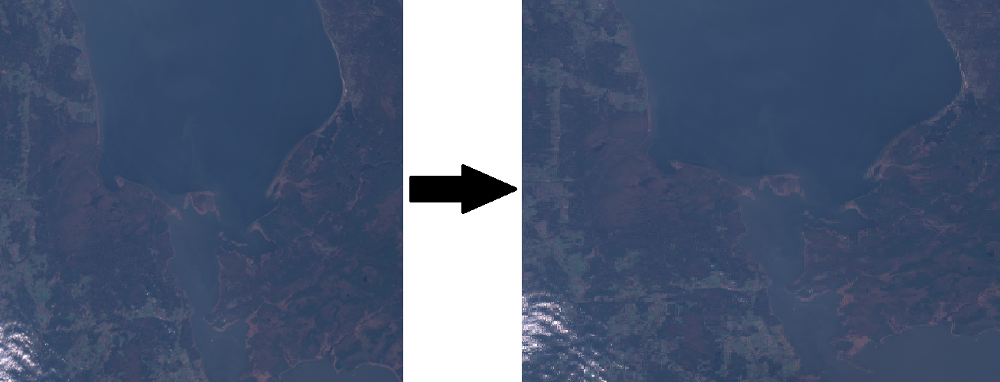
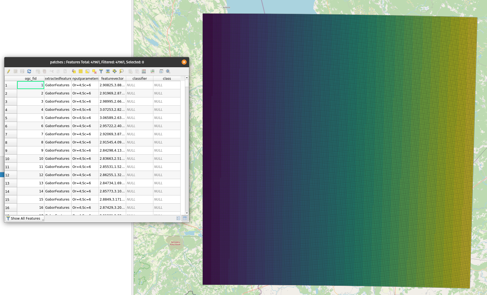
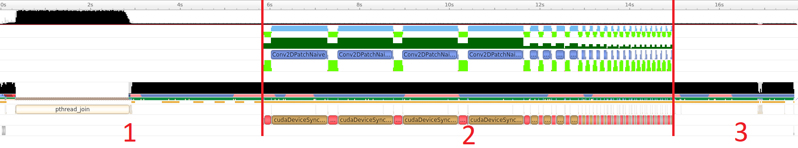

# alus-gfe

[BULPP](http://bulpp.eu/) - Project information page

## Arguments
```
ALUs - Gabor feature extraction
Version 1.3.0

Arguments:

  --help                    Print help
  -i [ --input ] arg        Input dataset path
  -d [ --destination ] arg  Results output path
  -f [ --frequency ] arg    Frequency count
  -p [ --patch ] arg        Patch edge dimension in pixels (patches are 
                            squares)
  -o [ --orientation ] arg  Orientation count
  --conv_destination arg    Path to save convolution inputs

  --ll arg (=verbose)       Log level, one of the following - 
                            verbose|debug|info|warning|error
  --gpu_mem arg (=100)      Percentage of how much GPU memory can be used for 
                            processing


https://bitbucket.org/cgi-ee-space/alus
```

## Processing overview

Using convolution to calculate gabor features.

Patches creation



Final results



Computing timeline (Sentinel-2 true color image)



Where section:
* 1 - Creating patches, filters and padding
* 2 - Computation
* 3 - Results storage


## Accolades
* ESA funded during [BULPP](http://bulpp.eu/)
* Developed by [CGI Estonia](https://www.cgi.com/ee/et)
* Algorithm expertise by [Politechnica University of Bucharest](https://upb.ro/en/)
