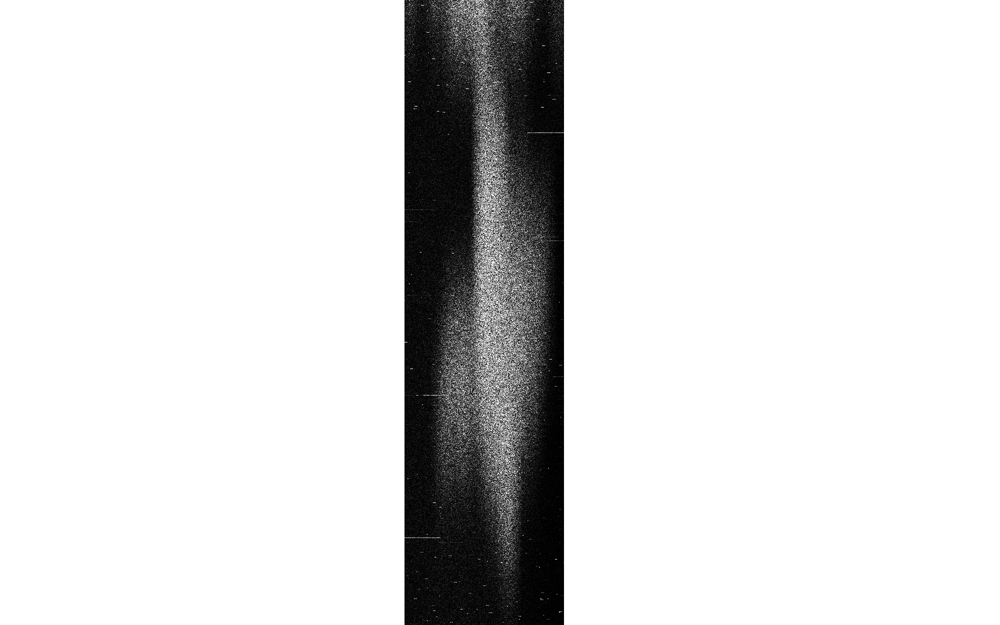
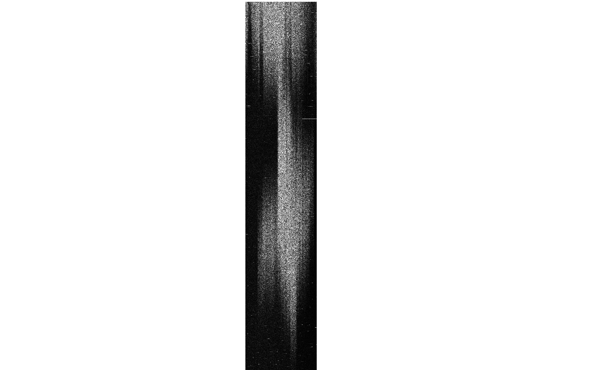
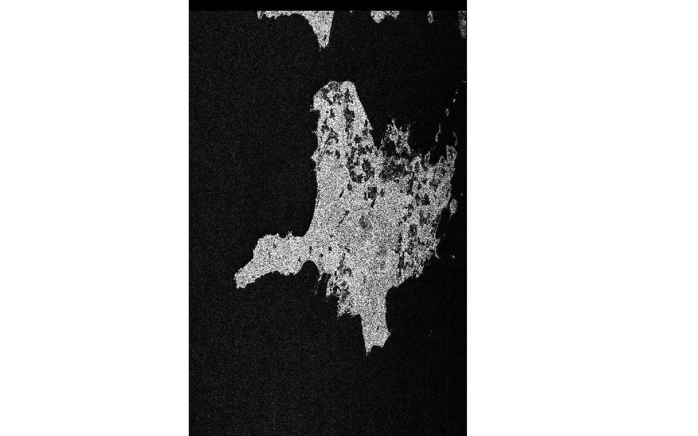
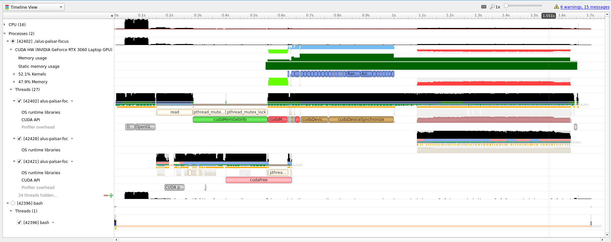

# alus-palsar-focus

PALSAR level0 -> level1 focusing CUDA implementation.

[BULPP](http://bulpp.eu/) - Project information page

### Arguments
```
  -h [ --help ]              Print help
  -i [ --input ] arg         Input directory path, folder with IMG, TRL, LED and VOL files
  -o [ --output ] arg        Output path
  -p [ --polarisation ] arg  Polarisation - HH, HV, VH or VV
  --intensity                Output images as Float32 intensity instead of 
                             CFloat32 complex
  --wif                      Write intermediate files
  --metadata                 Only print metadata, skip processing

  --ll arg (=verbose)        Log level, one of the following - 
                             verbose|debug|info|warning|error
  --gpu_mem arg (=100)       Percentage of how much GPU memory can be used for 
                             processing
```

## Example run

```
./alus-palsar-focus -i /home/[..path to dataset..]/AL1_OESA_FBD_RAW_0P_20080507T203727_20080507T203744_012177_0613_1170_0001/AL1_OESA_FBD_RAW_0P_20080507T203727_20080507T203744_012177_0613_1170_0001.CEOS/ -o /tmp/ramdisk -p HH --ll info
[2022-07-14 14:15:16.298840] [0x00007fc7e0a67000] [info]    Scene ID = ALPSRP121771175
[2022-07-14 14:15:16.469972] [0x00007fc7e0a67000] [info]    PRF(Hz) = 2141.33
[2022-07-14 14:15:16.469993] [0x00007fc7e0a67000] [info]    Frequency(GHz) = 1.27
[2022-07-14 14:15:16.469998] [0x00007fc7e0a67000] [info]    Wavelength(m) = 0.236057
[2022-07-14 14:15:16.470001] [0x00007fc7e0a67000] [info]    Range sampling rate(MHz) = 16
[2022-07-14 14:15:16.470008] [0x00007fc7e0a67000] [info]    Chirp samples = 432
[2022-07-14 14:15:16.470011] [0x00007fc7e0a67000] [info]    Chirp duration(us) = 27
[2022-07-14 14:15:16.470015] [0x00007fc7e0a67000] [info]    Chirp bandwidth(MHz) = 14
[2022-07-14 14:15:16.470019] [0x00007fc7e0a67000] [info]    Range x Azimuth = 5152 39402
[2022-07-14 14:15:16.470022] [0x00007fc7e0a67000] [info]    Range spacing(m) = 9.36851
[2022-07-14 14:15:16.470025] [0x00007fc7e0a67000] [info]    Platform velocity(m/s) = 7589.02
[2022-07-14 14:15:16.470055] [0x00007fc7e0a67000] [info]    First orbit time = 2008-May-07 20:24:36
[2022-07-14 14:15:16.470063] [0x00007fc7e0a67000] [info]    Center Lat/Lon = (59.0347738000 22.4038924000)
[2022-07-14 14:15:16.470074] [0x00007fc7e0a67000] [info]    Center time = 2008-May-07 20:37:36.055000
[2022-07-14 14:15:16.470078] [0x00007fc7e0a67000] [info]    Slant range to first sample(m) = 853161
[2022-07-14 14:15:16.470116] [0x00007fc7e0a67000] [info]    Calculated Vr = 7157.87
[2022-07-14 14:15:16.470134] [0x00007fc7e0a67000] [info]    Using 'NVIDIA GeForce RTX 3060 Laptop GPU' device nr 0 for calculations
[2022-07-14 14:15:16.635743] [0x00007fc7e0a67000] [info]    DC offset I,Q = 15.6299 15.6163
[2022-07-14 14:15:16.635762] [0x00007fc7e0a67000] [info]    total samples = 202638944
[2022-07-14 14:15:16.635769] [0x00007fc7e0a67000] [info]    Range padding 5152 -> 5600
[2022-07-14 14:15:16.635771] [0x00007fc7e0a67000] [info]    Azimuth padding 39402 -> 39690
[2022-07-14 14:15:16.665823] [0x00007fc7e0a67000] [info]    Doppler centroid(Hz) = -16.594
[2022-07-14 14:15:17.002591] [0x00007fc7e0a67000] [info]    Writing complex file @ /tmp/ramdisk/BULPP_ALPSRP121771175_HH_slc.tif
[2022-07-14 14:15:17.657746] [0x00007fc7e0a67000] [info]    Metadata file @ /tmp/ramdisk/BULPP_ALPSRP121771175_HH_slc.xml

```


## Focusing overview

Conceptually the full focusing chain can be subdivided into the following:

1) Parsing image and metadata files
2) Extract raw echoes(storage -> CPU -> GPU)
3) Range compression
4) Azimuth Compression(implements Low Squint Basic Range Doppler Algorithm)
5) Final output image + metadata writing (GPU -> CPU -> storage)

Only stripmap modes(PLR, FBD, FBS) are implemented.

## Example processing output, with intermediate intensity images displayed:

### Raw echoes

### Range compression

### Azimuth Compression


## Performance


This profile timeline picture gives an overall view of focusing a single FBD polarization image on a laptop.

From an overall performance point of view, the running time can be seen as three distinct steps:

1) Initialization, file loading, metadata parsing
2) Calculations on GPU
3) GPU -> CPU -> TIFF file write

The total runtime presented in the graph(<2 seconds) is achieved by tricks - the input file was read from a very fast NVMe SSD and the output file was written to a virtual RAM disk. In a many real cloud environment setups step 1 and 3 are multiple times longer and will usually dominate any time spent on the GPU. Step 2 measures GPU performance, the timeline graph was generated with a GTX3060 Mobile - using a better GPU can improve this section even further.

### GPU memory requirements

* PLR ~1 GB
* FBD ~4 GB
* FBS ~8 GB

### IO bottleneck

Given enough GPU memory, the bottleneck will almost always be the SSD read and write speeds.

If the output file is immediately consumed after generation, an option is to create a virtual disk on RAM(e.g tmpfs), which was done on the timeline shown above.

If benchmarking one should keep in mind that the OS you are using may have disk read and write caches, thus hiding the bottleneck.

### Special mentions
* ESA funded during [BULPP](http://bulpp.eu/)
* Developed by [CGI Estonia](https://www.cgi.com/ee/et).
* SAR expertise by [sarmap SA](https://www.sarmap.ch/)