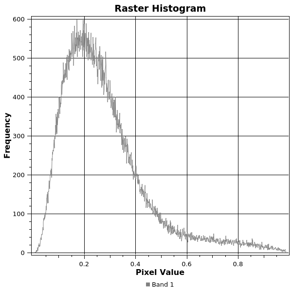
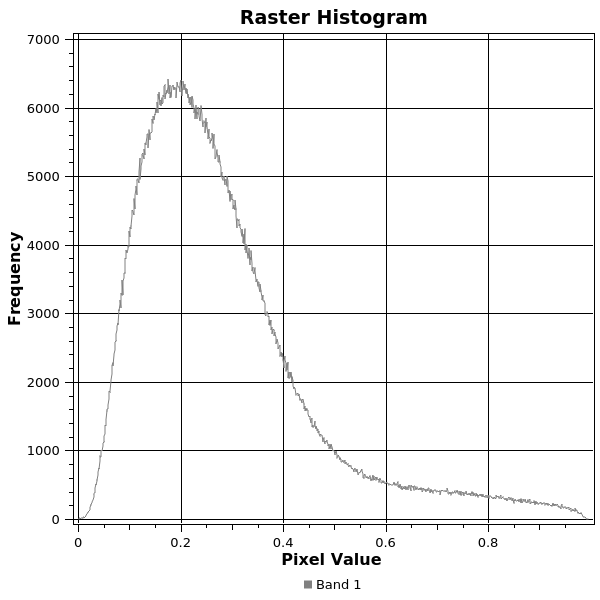

# SNAP COMPARISON

# Version 0.6 (pre 0.7 version)

### Software

|Component|Version|
|---|---|
|ALUS|0.6|
|SNAP engine|8.0.8|
|SNAP desktop|8.0.8|
|S1TBX|8.0.5|

### Benchmark hardware

|Component|Name|Spec|
|---|---|---|
|GPU|GeForce 940MX|CC 5.0 2GB memory|
|Nvidia driver| |455.38|
|CPU|i7-7820HQ CPU @ 2.90GHz|8 cores|
|Storage|SK hynix SC311 S|512GB|
|RAM|Hynix Semiconductor HMA82GS6AFR8N-UH| 16+8GiB @ 2400 MHz|


## Beirut explosion scenes

## Whole subswath IW1

|Parameter|Name|
|---|---|
|Reference scene|S1A_IW_SLC__1SDV_20200724T034334_20200724T034401_033591_03E49D_96AA|
|Secondary scene|S1A_IW_SLC__1SDV_20200805T034334_20200805T034401_033766_03E9F9_52F6|
|Polarization|VV|
|Subswath|IW1|

'*' - No elevation masking done in SNAP processing due to [backgeocoding bug](https://forum.step.esa.int/t/tile-size-is-affecting-coregistration-results/32193)

##### Data integrity

SNAP output was modified in order to translate **nodata** value correctly for statistics and raster view:
```gdal_calc.py -A S1A_IW_SLC__1SDV_20200724T034334_20200724T034401_033591_03E49D_96AA_Orb_Stack_coh_deb_TC.tif --outfile=S1A_IW_SLC__1SDV_20200724T034334_20200724T034401_033591_03E49D_96AA_Orb_Stack_coh_deb_TC_no_data0_calc.tif --calc="A*(A>0)" --NoDataValue=0```

Geotransformation and raster sizes match

Files differ at the binary level (some systematic errors from ALUS). Visually they look mostly identical, with some minor random dots produced by SNAP and minor different coherence pixel values.

**SNAP**

```
Origin = (34.704518111088746,34.868656377267165)
Pixel Size = (0.000125494645191,-0.000125494645191)
Metadata:
  AREA_OR_POINT=Area
Image Structure Metadata:
  INTERLEAVE=BAND
Corner Coordinates:
Upper Left  (  34.7045181,  34.8686564) ( 34d42'16.27"E, 34d52' 7.16"N)
Lower Left  (  34.7045181,  33.2034679) ( 34d42'16.27"E, 33d12'12.48"N)
Upper Right (  36.0330044,  34.8686564) ( 36d 1'58.82"E, 34d52' 7.16"N)
Lower Right (  36.0330044,  33.2034679) ( 36d 1'58.82"E, 33d12'12.48"N)
Center      (  35.3687613,  34.0360622) ( 35d22' 7.54"E, 34d 2' 9.82"N)
Band 1 Block=10586x1 Type=Float32, ColorInterp=Gray
    Computed Min/Max=0.000,0.992
  Minimum=0.000, Maximum=0.992, Mean=0.573, StdDev=0.201
  NoData Value=0
  Metadata:
    STATISTICS_MAXIMUM=0.99190706014633
    STATISTICS_MEAN=0.57313965666781
    STATISTICS_MINIMUM=6.7237124312669e-05
    STATISTICS_STDDEV=0.20127988859049
    STATISTICS_VALID_PERCENT=16.29
```

**ALUS**

```
Origin = (34.704518111088746,34.868656377267165)
Pixel Size = (0.000125494645191,-0.000125494645191)
Metadata:
  AREA_OR_POINT=Area
Image Structure Metadata:
  INTERLEAVE=BAND
Corner Coordinates:
Upper Left  (  34.7045181,  34.8686564) ( 34d42'16.27"E, 34d52' 7.16"N)
Lower Left  (  34.7045181,  33.2034679) ( 34d42'16.27"E, 33d12'12.48"N)
Upper Right (  36.0330044,  34.8686564) ( 36d 1'58.82"E, 34d52' 7.16"N)
Lower Right (  36.0330044,  33.2034679) ( 36d 1'58.82"E, 33d12'12.48"N)
Center      (  35.3687613,  34.0360622) ( 35d22' 7.54"E, 34d 2' 9.82"N)
Band 1 Block=272x512 Type=Float32, ColorInterp=Gray
    Computed Min/Max=0.000,0.992
  Minimum=0.000, Maximum=0.992, Mean=0.573, StdDev=0.201
  NoData Value=0
  Metadata:
    STATISTICS_MAXIMUM=0.99190676212311
    STATISTICS_MEAN=0.57322074652395
    STATISTICS_MINIMUM=5.1853394325008e-06
    STATISTICS_STDDEV=0.20130284526615
    STATISTICS_VALID_PERCENT=16.29
```

NB! Exactly same raster results were processed by Tesla V100 EC2 AWS instance

**gdalcompare**
```
Files differ at the binary level.
Band 1 checksum difference:
  Golden: 4920
  New:    6383
  Pixels Differing: 22865282
  Maximum Pixel Difference: 0.9733346104621887
Metadata value difference for key "STATISTICS_MAXIMUM"
  Golden: "0.99190706014633"
  New:    "0.99190676212311"
Metadata value difference for key "STATISTICS_MEAN"
  Golden: "0.57313965666781"
  New:    "0.57322074652395"
Metadata value difference for key "STATISTICS_MINIMUM"
  Golden: "6.7237124312669e-05"
  New:    "5.1853394325008e-06"
Metadata value difference for key "STATISTICS_STDDEV"
  Golden: "0.20127988859049"
  New:    "0.20130284526615"
Differences Found: 6
```

Produced files:  
[SNAP](https://alus-goods.s3.eu-central-1.amazonaws.com/snap_comparison/version0_6/S1A_IW_SLC__1SDV_20200724T034334_20200724T034401_033591_03E49D_96AA_Orb_Stack_coh_deb_TC.tif)  
[SNAP nodata corrected](https://alus-goods.s3.eu-central-1.amazonaws.com/snap_comparison/version0_6/S1A_IW_SLC__1SDV_20200724T034334_20200724T034401_033591_03E49D_96AA_Orb_Stack_coh_deb_TC_no_data0_calc.tif)  
[ALUS](https://alus-goods.s3.eu-central-1.amazonaws.com/snap_comparison/version0_6/S1A_IW_SLC__1SDV_20200724T034334_20200724T034401_033591_03E49D_96AA_Orb_Stack_IW1_coh_deb_tc_940mx.tif)  

## Single burst from IW1 (explosion area)

|Parameter|Name|
|---|---|
|Reference scene|S1A_IW_SLC__1SDV_20200724T034334_20200724T034401_033591_03E49D_96AA|
|Secondary scene|S1A_IW_SLC__1SDV_20200805T034334_20200805T034401_033766_03E9F9_52F6|
|Polarization|VV|
|Subswath|IW1|
|Reference bursts|6-6|
|Secondary bursts|5-7|

'*' - No elevation masking done in SNAP processing due to [backgeocoding bug](https://forum.step.esa.int/t/tile-size-is-affecting-coregistration-results/32193)

##### Data integrity

SNAP output was modified in order to translate **nodata** value correctly for statistics and raster view:
```gdal_calc.py -A S1A_IW_SLC__1SDV_20200724T034334_20200724T034401_033591_03E49D_96AA_Orb_Stack_coh_deb_TC.tif --outfile=S1A_IW_SLC__1SDV_20200724T034334_20200724T034401_033591_03E49D_96AA_Orb_Stack_coh_deb_TC_no_data0_calc.tif --calc="A*(A>0)" --NoDataValue=0```

Geotransformation and raster sizes match

Files differ at the binary level (some systematic errors from ALUS). Visually they look mostly identical, with some minor random dots produced by SNAP and minor different coherence pixel values.  
ALUS' output has coherence values 0 on near coast for some pixels(highlighted in the picture below)


**SNAP**

```
Origin = (34.814112450960536,34.038723198598859)
Pixel Size = (0.000125494645191,-0.000125494645191)
Metadata:
  AREA_OR_POINT=Area
Image Structure Metadata:
  INTERLEAVE=BAND
Corner Coordinates:
Upper Left  (  34.8141125,  34.0387232) ( 34d48'50.80"E, 34d 2'19.40"N)
Lower Left  (  34.8141125,  33.7026485) ( 34d48'50.80"E, 33d42' 9.53"N)
Upper Right (  35.8140538,  34.0387232) ( 35d48'50.59"E, 34d 2'19.40"N)
Lower Right (  35.8140538,  33.7026485) ( 35d48'50.59"E, 33d42' 9.53"N)
Center      (  35.3140831,  33.8706859) ( 35d18'50.70"E, 33d52'14.47"N)
Band 1 Block=7968x1 Type=Float32, ColorInterp=Gray
    Computed Min/Max=0.000,0.988
  Minimum=0.000, Maximum=0.988, Mean=0.551, StdDev=0.203
  NoData Value=0
  Metadata:
    STATISTICS_MAXIMUM=0.98772579431534
    STATISTICS_MEAN=0.55073992347174
    STATISTICS_MINIMUM=8.1879852587008e-06
    STATISTICS_STDDEV=0.2026757863316
    STATISTICS_VALID_PERCENT=16.01
```

**ALUS**
```
Origin = (34.814112450960536,34.038723198598859)
Pixel Size = (0.000125494645191,-0.000125494645191)
Metadata:
  AREA_OR_POINT=Area
Image Structure Metadata:
  INTERLEAVE=BAND
Corner Coordinates:
Upper Left  (  34.8141125,  34.0387232) ( 34d48'50.80"E, 34d 2'19.40"N)
Lower Left  (  34.8141125,  33.7026485) ( 34d48'50.80"E, 33d42' 9.53"N)
Upper Right (  35.8140538,  34.0387232) ( 35d48'50.59"E, 34d 2'19.40"N)
Lower Right (  35.8140538,  33.7026485) ( 35d48'50.59"E, 33d42' 9.53"N)
Center      (  35.3140831,  33.8706859) ( 35d18'50.70"E, 33d52'14.47"N)
Band 1 Block=400x448 Type=Float32, ColorInterp=Gray
    Computed Min/Max=0.000,0.988
  Minimum=0.000, Maximum=0.988, Mean=0.551, StdDev=0.203
  NoData Value=0
  Metadata:
    STATISTICS_MAXIMUM=0.98772555589676
    STATISTICS_MEAN=0.55077485581291
    STATISTICS_MINIMUM=8.186523700715e-06
    STATISTICS_STDDEV=0.20270094973491
    STATISTICS_VALID_PERCENT=16.01
```

NB! Exactly same raster results were processed by Tesla V100 EC2 AWS instance

**gdalcompare**
```
Files differ at the binary level.
Band 1 checksum difference:
  Golden: 58987
  New:    58992
  Pixels Differing: 3390270
  Maximum Pixel Difference: 0.9347190856933594
Metadata value difference for key "STATISTICS_MAXIMUM"
  Golden: "0.98772579431534"
  New:    "0.98772555589676"
Metadata value difference for key "STATISTICS_MEAN"
  Golden: "0.55073992347174"
  New:    "0.55077485581291"
Metadata value difference for key "STATISTICS_MINIMUM"
  Golden: "8.1879852587008e-06"
  New:    "8.186523700715e-06"
Metadata value difference for key "STATISTICS_STDDEV"
  Golden: "0.2026757863316"
  New:    "0.20270094973491"
Differences Found: 6
```

Produced files:  
[SNAP](https://alus-goods.s3.eu-central-1.amazonaws.com/snap_comparison/version0_6/S1A_IW_SLC__1SDV_20200724T034334_20200724T034401_033591_03E49D_96AA_Orb_Stack_b6_coh_deb_TC.tif)  
[SNAP nodata corrected](https://alus-goods.s3.eu-central-1.amazonaws.com/snap_comparison/version0_6/S1A_IW_SLC__1SDV_20200724T034334_20200724T034401_033591_03E49D_96AA_Orb_Stack_b6_coh_deb_TC_no_data0_calc.tif)  
[ALUS](https://alus-goods.s3.eu-central-1.amazonaws.com/snap_comparison/version0_6/S1A_IW_SLC__1SDV_20200724T034334_20200724T034401_033591_03E49D_96AA_Orb_Stack_IW1_b6_coh_deb_tc_940mx.tif)  

ALUS discrepancies on the coastal line of Beirut displayed in QGIS:


Some of the pixels "missing" due to value being equal to NO_DATA value. Coastal line otherwise matches exactly the SNAP one.

## Belgium and Germany 2021 floods

|Parameter|Name|
|---|---|
|Reference scene|S1A_IW_SLC__1SDV_20210703T055050_20210703T055117_038609_048E45_35F7|
|Secondary scene|S1B_IW_SLC__1SDV_20210721T055001_20210721T055028_027888_0353E2_E1B5|
|Polarization|VV|
|Subswath|IW3|
|Reference bursts|3-6|
|Secondary bursts|6-9|


##### Data integrity

Geotransformation and raster sizes match

Files differ at the binary level (some systematic errors from ALUS and SNAP has 2 different values for NO_DATA in the raster which deviates statistics). Visually they look identical.

**SNAP**
```
Origin = (3.533990225282300,50.749011639226850)
Pixel Size = (0.000124506498379,-0.000124506498379)
Metadata:
  AREA_OR_POINT=Area
  TIFFTAG_RESOLUTIONUNIT=1 (unitless)
  TIFFTAG_XRESOLUTION=1
  TIFFTAG_YRESOLUTION=1
Image Structure Metadata:
  COMPRESSION=LZW
  INTERLEAVE=BAND
Corner Coordinates:
Upper Left  (   3.5339902,  50.7490116) (  3d32' 2.36"E, 50d44'56.44"N)
Lower Left  (   3.5339902,  49.9454467) (  3d32' 2.36"E, 49d56'43.61"N)
Upper Right (   4.9030637,  50.7490116) (  4d54'11.03"E, 50d44'56.44"N)
Lower Right (   4.9030637,  49.9454467) (  4d54'11.03"E, 49d56'43.61"N)
Center      (   4.2185270,  50.3472292) (  4d13' 6.70"E, 50d20'50.03"N)
Band 1 Block=608x464 Type=Float32, ColorInterp=Gray
    Computed Min/Max=0.000,0.996
  Minimum=0.000, Maximum=0.996, Mean=0.192, StdDev=0.187
  Metadata:
    STATISTICS_MAXIMUM=0.9963304400444
    STATISTICS_MEAN=0.19207348528334
    STATISTICS_MINIMUM=0
    STATISTICS_STDDEV=0.1869375707905
    STATISTICS_VALID_PERCENT=100
```

**ALUS**
```
Origin = (3.533990225282300,50.749011639226850)
Pixel Size = (0.000124506498379,-0.000124506498379)
Metadata:
  AREA_OR_POINT=Area
Image Structure Metadata:
  INTERLEAVE=BAND
Corner Coordinates:
Upper Left  (   3.5339902,  50.7490116) (  3d32' 2.36"E, 50d44'56.44"N)
Lower Left  (   3.5339902,  49.9454467) (  3d32' 2.36"E, 49d56'43.61"N)
Upper Right (   4.9030637,  50.7490116) (  4d54'11.03"E, 50d44'56.44"N)
Lower Right (   4.9030637,  49.9454467) (  4d54'11.03"E, 49d56'43.61"N)
Center      (   4.2185270,  50.3472292) (  4d13' 6.70"E, 50d20'50.03"N)
Band 1 Block=256x432 Type=Float32, ColorInterp=Gray
    Computed Min/Max=0.000,0.996
  Minimum=0.000, Maximum=0.996, Mean=0.277, StdDev=0.164
  NoData Value=0
  Metadata:
    STATISTICS_MAXIMUM=0.99632966518402
    STATISTICS_MEAN=0.27706657913998
    STATISTICS_MINIMUM=3.5474431570037e-06
    STATISTICS_STDDEV=0.16394830629194
    STATISTICS_VALID_PERCENT=69.35
```

NB! Exactly same raster results were processed by Tesla V100 EC2 AWS instance

Produced files:  
[SNAP](https://alus-goods.s3.eu-central-1.amazonaws.com/snap_comparison/version0_6/S1A_IW_SLC__1SDV_20210703T055050_20210703T055117_038609_048E45_35F7_Orb_Stack_coh_deb_TC.tif)  
[ALUS](https://alus-goods.s3.eu-central-1.amazonaws.com/snap_comparison/version0_6/S1A_IW_SLC__1SDV_20210703T055050_20210703T055117_038609_048E45_35F7_Orb_Stack_coh_deb_tc.tif)

Histogram comparisons in QGIS

SNAP


ALUS



## Maharashtra floods

|Parameter|Name|
|---|---|
|scene|S1A_IW_SLC__1SDV_20210722T005537_20210722T005604_038883_049695_2E58|
|Polarization|VV|
|Subswath|IW2|
|bursts|2-6|
|calibration type|Gamma0|

##### Data integrity

Geotransformation and raster sizes match

Files differ at the binary level (SNAP has 2 different values for NO_DATA in the raster which deviates statistics). Visually they look identical.

**SNAP**
```
Origin = (73.627702789912618,17.481024566250053)
Pixel Size = (0.000125674308248,-0.000125674308248)
Metadata:
  AREA_OR_POINT=Area
  TIFFTAG_RESOLUTIONUNIT=1 (unitless)
  TIFFTAG_XRESOLUTION=1
  TIFFTAG_YRESOLUTION=1
Image Structure Metadata:
  COMPRESSION=LZW
  INTERLEAVE=BAND
Corner Coordinates:
Upper Left  (  73.6277028,  17.4810246) ( 73d37'39.73"E, 17d28'51.69"N)
Lower Left  (  73.6277028,  16.4712315) ( 73d37'39.73"E, 16d28'16.43"N)
Upper Right (  74.6400093,  17.4810246) ( 74d38'24.03"E, 17d28'51.69"N)
Lower Right (  74.6400093,  16.4712315) ( 74d38'24.03"E, 16d28'16.43"N)
Center      (  74.1338561,  16.9761280) ( 74d 8' 1.88"E, 16d58'34.06"N)
Band 1 Block=544x576 Type=Float32, ColorInterp=Gray
    Computed Min/Max=0.000,3692.317
  Minimum=0.000, Maximum=3692.317, Mean=0.204, StdDev=1.579
  Metadata:
    STATISTICS_MAXIMUM=3692.3166503906
    STATISTICS_MEAN=0.20374974321315
    STATISTICS_MINIMUM=0
    STATISTICS_STDDEV=1.5792037115203
    STATISTICS_VALID_PERCENT=100
```

**ALUS**
```
Origin = (73.627702789912618,17.481024566250053)
Pixel Size = (0.000125674308248,-0.000125674308248)
Metadata:
  AREA_OR_POINT=Area
Image Structure Metadata:
  INTERLEAVE=BAND
Corner Coordinates:
Upper Left  (  73.6277028,  17.4810246) ( 73d37'39.73"E, 17d28'51.69"N)
Lower Left  (  73.6277028,  16.4712315) ( 73d37'39.73"E, 16d28'16.43"N)
Upper Right (  74.6400093,  17.4810246) ( 74d38'24.03"E, 17d28'51.69"N)
Lower Right (  74.6400093,  16.4712315) ( 74d38'24.03"E, 16d28'16.43"N)
Center      (  74.1338561,  16.9761280) ( 74d 8' 1.88"E, 16d58'34.06"N)
Band 1 Block=448x448 Type=Float32, ColorInterp=Gray
    Computed Min/Max=0.000,3692.317
  Minimum=0.000, Maximum=3692.317, Mean=0.286, StdDev=1.865
  NoData Value=0
  Metadata:
    STATISTICS_MAXIMUM=3692.3166503906
    STATISTICS_MEAN=0.28606595623088
    STATISTICS_MINIMUM=6.5092075374196e-07
    STATISTICS_STDDEV=1.8649079802383
    STATISTICS_VALID_PERCENT=71.22
```

NB! Exactly same raster results were processed by Tesla V100 EC2 AWS instance

Produced files:  
[SNAP](https://alus-goods.s3.eu-central-1.amazonaws.com/snap_comparison/version0_6/S1A_IW_SLC__1SDV_20210722T005537_20210722T005604_038883_049695_2E58_split_Cal_deb_TC.tif)  
[ALUS](https://alus-goods.s3.eu-central-1.amazonaws.com/snap_comparison/version0_6/S1A_IW_SLC__1SDV_20210722T005537_20210722T005604_038883_049695_2E58_Calib_b26_tc_mx940.tif)


